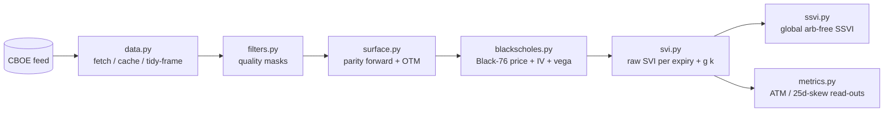

# Architecture

> Current-state technical design of the system. Update via the cascade rule when structure changes.

## Overview

Builds an SPX implied-volatility surface from CBOE's delayed option chain. The flow is a
linear pipeline: **fetch → clean → construct → price**, one tidy contract frame threaded
through each stage. Each stage is a small module with one responsibility; detail lives in the
code docstrings, not here.

## Components
_Each major unit and its single responsibility._

- **`data.py`** — the only place the data source lives. Fetches the SPX chain from CBOE's
  delayed feed, freezes dated snapshots to disk, and flattens the JSON into one tidy row per
  contract. Swapping to purchased history touches nothing downstream.
- **`filters.py`** — contract-quality masks (each takes the frame, returns a boolean keep-mask,
  composes with `&`). v1 defaults: `bidask_mask` + `expiry_mask`. Available but off by default:
  `staleness_mask`, `volume_mask` (ADR 008/009). Cleaning only — never modifies a row.
- **`surface.py`** — *construction*, not cleaning: derives each expiry's forward `F` from
  put-call parity (`forward_by_expiry`), uses it to pick the reliable OTM side (`select_otm`)
  and place the `ln(K/F)` moneyness axis, and collapses each expiry to one root (`blend_roots`:
  SPXW ≤60d, richest beyond; ADR 015). Depends on the modeled forward, so it runs **after** the
  quote filters (the forward is computed from the surviving set).
- **`blackscholes.py`** — Black-76 pricing off the parity forward. `bs_price` maps σ → price;
  `implied_vol` inverts price → σ numerically (safeguarded Newton–bisection); `bs_vega` = ∂price/∂σ
  (fit weights + a future Newton solver). CBOE's `iv` is the validation oracle, never an input
  (ADR 010).
- **`svi.py`** — raw SVI per expiry in total-variance space. `svi_w` (the parameterization),
  `fit_slice` (Zeliade quasi-explicit: exact linear solve for `a, bρ, b` inside a 2-D
  Nelder-Mead search over `m, σ`), `fit_surface` (per-expiry loop → param table + diagnostics),
  `svi_g` (Gatheral-Jacquier butterfly `g(k) ≥ 0`). ADR 012.
- **`ssvi.py`** — global SSVI surface. `ssvi_w` (power-law `φ(θ)=η θ^{-γ}`), `fit_ssvi` (one
  `(ρ, η, γ)` fit under GJ Thm 4.2 butterfly constraints → arb-free by construction),
  `atm_theta` (θ_T term structure from the raw-SVI ATM). ADR 013.
- **`metrics.py`** — read-outs off the fitted surface: `surface_metrics` (the three standard
  quotes — ATM vol, 25-delta skew/risk-reversal, 25-delta fly/curvature — per expiry),
  `forward_vol` (vol of the future window between adjacent expiries; an event radar) and
  `butterfly_free_fraction`. Needs the fit — the 25-delta strike is rarely listed, so it's
  read off the curve.

## Data / interfaces
_Key data models and the durable interface surface._

- **Tidy contract frame** (`chain_to_frame`): one row per option. Columns `root, expiry, T,
  type ('C'/'P'), strike, bid, ask, mid, volume, open_interest, last_trade_time, cboe_iv`;
  snapshot `spot` / as-of `asof` in `df.attrs`. `surface.py` attaches `F` (forward per expiry).
- **Pipeline order matters at one seam:** per-row quote masks commute freely, but the forward /
  OTM step reads the whole surviving set to compute `F`, so it must run after cleaning.
- **Price convention:** mid, `T` = calendar-days/365 (ADR 002); forward via parity, rate `r`
  the only free input (ADR 003).
